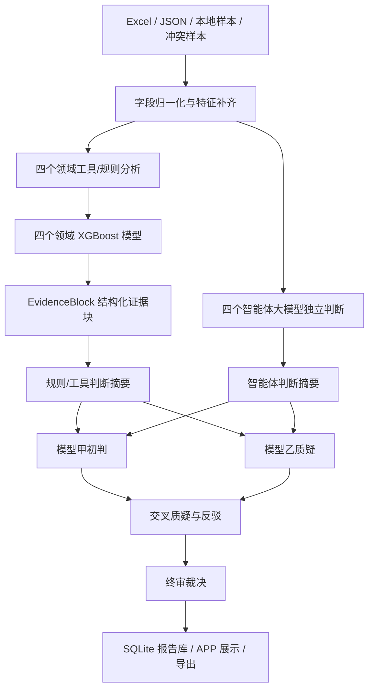

# MalApp 智能研判平台项目指南

版本日期：2026-06-29  
项目目录：`C:\Users\啤酒肚\Desktop\工作\test1`

本文档用于说明这个恶意 APP 智能研判平台的项目结构、核心代码、数据格式、训练流程、运行方式、打包方式、模型连接方式、报告保存位置和常见问题。它不是只给开发看的 README，而是偏“项目交付说明 + 操作手册 + 代码导览”。

---

## 1. 项目目标

本项目的目标是把恶意 APP 研判流程做成一个可运行的桌面端/网页端 APP：

1. 支持导入 Excel、JSON、本地样本库、冲突样本。
2. 支持按批次加载 N 条数据，再自动研判 M 条数据。
3. 支持四个领域智能体并行分析：
   - 静态分析智能体
   - 情报溯源智能体
   - 仿冒研判智能体
   - 业务打标智能体
4. 支持 XGBoost 机器学习模型给出领域恶意概率、融合概率和 WEC 决策概率。
5. 支持模型甲、模型乙双模型辩论。
6. 支持 Hermes MCP 兼容编排。
7. 支持报告缓存，同一 MD5 样本可复用历史研判结果。
8. 支持暂停、继续、批量研判、导出 JSON/TXT。
9. 支持桌面端 EXE 打包。

---

## 2. 总体架构

当前工程采用“确定性工具 + 机器学习 + 大模型解释/辩论”的分层架构。



核心原则：

- 工具和 XGBoost 负责事实、字段、概率和稳定证据。
- 大模型负责解释、摘要、矛盾分析和辩论。
- 不应该让大模型直接生成底层概率。
- 不应该只依赖 XGBoost 跳过大模型推理。
- 四个智能体的大模型判断应尽量只看本领域原始特征，而不是复读规则证据块。

---

## 3. 目录结构

项目根目录：

```text
C:\Users\啤酒肚\Desktop\工作\test1
```

主要目录说明：

| 路径 | 作用 |
|---|---|
| `run.py` | 后端 HTTP 服务入口，提供 APP 页面和 `/api/...` 接口 |
| `desktop_launcher.py` | 桌面端启动器，启动本地服务并打开界面 |
| `desktop_launcher_82_tunnel.py` | 82 跳板隧道版桌面启动器，强制使用本地转发接口 |
| `engine/` | 研判引擎核心代码 |
| `web/` | 前端页面、样式和 JS |
| `ml_pipeline/` | 训练流水线代码 |
| `tools/` | 数据转换、训练、诊断、隧道脚本 |
| `training_artifacts/` | 训练产物、模型、测试集、损失曲线 |
| `converted_data/` | 已转换成 APP 可导入格式的数据 |
| `data/` | APP 运行时数据库、配置、样例数据 |
| `release/` | 已打包的桌面端 EXE 版本 |
| `docs/` | 项目文档 |
| `deploy/` | 部署相关文件 |
| `hermes/` | Hermes/MCP 兼容相关文件 |

---

## 4. 核心代码导览

### 4.1 后端入口：`run.py`

`run.py` 是本项目的 HTTP 服务入口，负责：

- 返回前端页面。
- 提供 API。
- 接收样本。
- 调用 `engine.pipeline.judge()` 完成研判。
- 管理模型配置。
- 管理数据导入、批量任务、暂停/继续。

重要接口：

| 接口 | 作用 |
|---|---|
| `GET /api/health` | 服务健康检查 |
| `GET /api/model/settings` | 读取模型配置 |
| `POST /api/model/settings` | 保存并检测模型配置 |
| `POST /api/data/import-excel` | 导入 Excel |
| `GET /api/batches` | 查看导入批次 |
| `POST /api/batch-jobs/start` | 启动批量研判 |
| `POST /api/batch-jobs/pause` | 暂停批量研判 |
| `POST /api/batch-jobs/resume` | 继续批量研判 |
| `POST /api/judgements` | 对单个样本发起研判 |
| `GET /api/reports` | 查看历史报告 |
| `GET /api/features/sample` | 按 MD5 读取特征样本 |

### 4.2 主研判流水线：`engine/pipeline.py`

这是最核心的文件。它完成：

1. 初始化数据库。
2. 字段归一化。
3. 查缓存。
4. 静态分析。
5. 情报溯源。
6. 仿冒研判。
7. 业务打标。
8. 生成 EvidenceBlock。
9. 调用 XGBoost。
10. 调用双模型辩论。
11. 生成最终报告。
12. 报告入库。

关键变量：

```python
DATA_DIR = Path(os.getenv("MALAPP_DATA_DIR", str(ROOT / "data"))).expanduser().resolve()
DB_PATH = DATA_DIR / "mvp.db"
```

含义：

- 默认运行数据放在 `test1\data`。
- 如果设置了环境变量 `MALAPP_DATA_DIR`，则使用指定目录。
- 报告、导入批次、模型配置、缓存等运行时数据保存在 `mvp.db`。

关键函数：

| 函数 | 作用 |
|---|---|
| `init_db()` | 初始化 SQLite 数据库 |
| `judge(raw_sample)` | 主研判入口 |
| `insert_report(report)` | 保存研判报告 |
| `list_reports(limit)` | 查询历史报告 |
| `build_xgb_fast_path_debate()` | 旧版 XGBoost 快速辩论结构 |
| `apply_xgb_agent_scores()` | 把 XGBoost 领域概率写入四智能体证据 |

### 4.3 批量任务：`engine/batch_judgement.py`

负责 APP 里的“自动研判流水线”：

- 从指定数据批次中取样本。
- 逐条调用 `judge()`。
- 记录成功、失败、当前进度。
- 支持暂停和继续。

批量任务的结果也保存在 `mvp.db`。

### 4.4 模型配置：`engine/model_settings.py`

负责服务器模型和本地模型配置。

默认模型甲：

```python
DEFAULT_SERVER_A_URL = "http://10.0.11.55:10000/v1"
DEFAULT_SERVER_A_MODEL = "Qwen3.6-35B-A3B-FP8"
DEFAULT_SERVER_A_API_KEY = "EMPTY"
```

默认模型乙：

```python
DEFAULT_SERVER_B_URL = "http://10.0.11.82:18012/v1"
DEFAULT_SERVER_B_MODEL = "malapp-model-b"
```

模型配置保存位置：

```text
C:\Users\啤酒肚\Desktop\工作\test1\data\model_settings.json
```

如果使用 82 跳板隧道版 APP，会通过 `desktop_launcher_82_tunnel.py` 强制改成本地转发地址：

```text
模型甲：http://127.0.0.1:10000/v1
模型乙：http://127.0.0.1:18012/v1
```

### 4.5 双模型辩论：`engine/debate_flow.py`

负责模型甲、模型乙、质疑、反驳、终审裁决。

当前设计：

| 角色 | 作用 |
|---|---|
| 模型甲 | 综合初判，引用四智能体证据，给出结构化结论 |
| 模型乙 | 质疑模型甲，找证据遗漏、逻辑跳跃、矛盾和反例 |
| 交叉质疑 | 甲质疑乙，乙质疑甲 |
| 反驳 | 双方回应对方质疑 |
| 终审 | 综合四智能体、XGBoost、模型甲乙观点给出最终裁决 |

提示词里已经要求：

- 模型甲乙都要看四智能体的智能体判断和规则判断。
- 不允许只看 XGBoost。
- 即使 XGBoost 高置信，也应进入大模型推理。
- 如果智能体判断与规则判断不一致，要分析差异原因。

### 4.6 四智能体证据层：`engine/evidence_layers.py`

负责三层证据结构：

1. Raw Evidence：原始字段和工具结果。
2. Structured EvidenceBlock：程序生成的稳定证据块。
3. LLM Explanation / Agent Judgement：大模型基于原始特征给出的智能体判断。

注意：当前文件中有部分中文字符串出现编码损坏，这会影响大模型提示词质量和部分界面提示质量。后续应优先修复该文件的中文提示词。

### 4.7 XGBoost 运行时：`engine/xgb_runtime.py`

负责加载训练好的 XGBoost 模型并在研判时预测。

模型默认来自：

```text
training_artifacts\xgb_selected_20260616\models
```

包括：

| 模型 | 作用 |
|---|---|
| `static_analysis.json` | 静态分析智能体领域概率 |
| `threat_intel.json` | 情报溯源智能体领域概率 |
| `impersonation.json` | 仿冒研判智能体领域概率 |
| `business_label.json` | 业务打标智能体领域概率 |
| `fusion.json` | 四智能体融合概率 |
| `wec.json` | A/B/C 三引擎协同最终概率 |
| `thresholds.json` | 验证集自动搜索得到的良性/恶意阈值 |
| `runtime_manifest.json` | 运行时模型清单 |

---

## 5. 四个智能体如何工作

### 5.1 静态分析智能体

职责：

- 验证签名一致性。
- 识别加固、壳、混淆。
- 检查 SDK 风险。
- 检查高危权限。
- 输出静态可信度、异常项列表。

主要输入字段：

```text
md5
sha1
sha256
app_name
package_name
signature_status
certificate_fingerprint
cert_sha1
cert_sha256
packer
permissions
sdk_list
apk_analysis
```

相关代码：

```text
engine/static_features.py
engine/evidence_layers.py
engine/pipeline.py
training_artifacts/xgb_selected_20260616/models/static_analysis.json
```

### 5.2 情报溯源智能体

职责：

- 挖掘 C2 域名、IP、URL。
- 关联邮箱、手机号。
- 匹配 IOC、威胁情报、黑产家族。
- 输出威胁命中记录和家族关联图。

主要输入字段：

```text
control_url
download_url
control_mailbox
control_phone
domains
ips
iocs
threat_intel_records
fraud_family
```

相关代码：

```text
engine/threat_intelligence.py
engine/evidence_layers.py
engine/pipeline.py
training_artifacts/xgb_selected_20260616/models/threat_intel.json
```

### 5.3 仿冒研判智能体

职责：

- 对比正版 APP 的图标、包名、名称、开发者、签名。
- 判断是否仿冒。
- 输出仿冒置信度和仿冒分类。

主要输入字段：

```text
fake_app
official_app_name
official_pkg
official_md5
brand_similarity
icon_hash
icon_text
package_name
app_name
genuine_package_match
genuine_signature_match
name_obfuscation
```

相关代码：

```text
engine/impersonation.py
engine/evidence_layers.py
engine/pipeline.py
training_artifacts/xgb_selected_20260616/models/impersonation.json
```

### 5.4 业务打标智能体

职责：

- 把技术特征翻译成反诈业务标签。
- 判断涉诈大类、小类、危害类型、家族、版本状态。
- 输出业务危害风险。

主要输入字段：

```text
fraud_category_big
fraud_category_small
harm_type
fraud_family
risk_score
version_status
virus_name
virus_description
business_harm_labels
harm_chain
```

相关代码：

```text
engine/business_label.py
engine/evidence_layers.py
engine/pipeline.py
training_artifacts/xgb_selected_20260616/models/business_label.json
```

---

## 6. 分数体系说明

项目里容易混淆的有三个数字：

1. 恶意概率
2. 证据强度
3. 置信度

### 6.1 恶意概率

恶意概率是机器学习模型输出的概率，通常来自 XGBoost。

例如：

```text
仿冒研判智能体：恶意概率 0.819
```

意思是：

> 仿冒领域 XGBoost 根据当前样本的仿冒相关特征，预测该样本偏恶意的概率为 81.9%。

它不是人工写死的分数，而是训练出来的模型预测值。

### 6.2 证据强度

证据强度是单条证据对结论的支持力度。

例如：

```text
加固或混淆：证据强度 0.680
黑产家族：证据强度 0.740
SDK 风险：证据强度 0.640
```

含义：

| 数值 | 含义 |
|---|---|
| 接近 0 | 证据很弱 |
| 0.3 到 0.5 | 较弱或辅助证据 |
| 0.5 到 0.7 | 中等证据 |
| 0.7 以上 | 强证据 |

当前证据强度有两类来源：

- 规则/工具根据字段命中情况给出的证据强度。
- XGBoost 概率被作为“机器学习恶意概率”证据块写入。

### 6.3 置信度

置信度不是“恶意概率”，而是“当前判断靠不靠谱”。

置信度会受这些因素影响：

- 字段是否齐全。
- 证据是否一致。
- XGBoost 概率是否远离 0.5。
- 大模型判断和规则判断是否冲突。
- 是否缺少关键字段，比如权限、控制端地址、正版图标、域名/IP。

举例：

```text
恶意概率 0.819，置信度 47%
```

说明：

- 模型认为恶意概率偏高。
- 但由于字段缺失、规则判断和大模型判断冲突、证据链不完整，可靠程度只有 47%。

这就是为什么会出现“规则/大模型认为良性，但右上角恶意概率很高”的情况。恶意概率来自 XGBoost 的领域模型；规则和大模型可能基于更窄的原始字段判断。如果输入字段缺失或训练特征偏置明显，两者就会冲突。

---

## 7. XGBoost 是怎么训练的

### 7.1 训练脚本

当前最重要的训练脚本：

```text
tools\train_selected_xgb_from_excels.py
```

底层通用训练逻辑：

```text
ml_pipeline\xgb_pipeline.py
```

### 7.2 训练使用的数据

用户指定的四个训练文件：

```text
converted_data\selected_app_import_20260616\malicious_5000_APP可导入_单Sheet.xlsx
converted_data\selected_app_import_20260616\white_2000_APP可导入_单Sheet.xlsx
converted_data\selected_app_import_20260616\manual_360_cm_conflict_APP可导入_单Sheet.xlsx
converted_data\selected_app_import_20260616\consensus_360_cm_score0_1200_APP可导入_单Sheet.xlsx
```

训练计划：

| 数据 | 用途 | 标签 | 权重 |
|---|---|---|---|
| 5000 恶意样本 | 训练四智能体和融合层 | 恶意 | 1.0 |
| 2000 白样本 | 训练四智能体和融合层 | 良性 | 1.0 |
| 人工标注冲突样本 | 取 3000 训练/验证，剩余测试 | 按人工标注 | 0.9 |
| 360/CM 一致 0 分样本 | 取 800 训练/验证，剩余测试 | 良性 | 0.9 |

### 7.3 一次完整训练命令

在项目目录执行：

```powershell
cd C:\Users\啤酒肚\Desktop\工作\test1
.\.venv\Scripts\python.exe tools\train_selected_xgb_from_excels.py `
  --malicious converted_data\selected_app_import_20260616\malicious_5000_APP可导入_单Sheet.xlsx `
  --white converted_data\selected_app_import_20260616\white_2000_APP可导入_单Sheet.xlsx `
  --manual converted_data\selected_app_import_20260616\manual_360_cm_conflict_APP可导入_单Sheet.xlsx `
  --consensus converted_data\selected_app_import_20260616\consensus_360_cm_score0_1200_APP可导入_单Sheet.xlsx `
  --out training_artifacts\xgb_selected_20260616
```

### 7.4 训练输出

训练完成后会生成：

```text
training_artifacts\xgb_selected_20260616
```

重要产物：

| 文件 | 作用 |
|---|---|
| `training_report.json` | 训练报告、样本数量、loss、特征重要性 |
| `models\static_analysis.json` | 静态分析模型 |
| `models\threat_intel.json` | 情报溯源模型 |
| `models\impersonation.json` | 仿冒研判模型 |
| `models\business_label.json` | 业务打标模型 |
| `models\fusion.json` | 四智能体融合模型 |
| `models\wec.json` | A/B/C 协同决策模型 |
| `models\thresholds.json` | 自动搜索出的阈值 |
| `models\runtime_manifest.json` | APP 运行时模型清单 |
| `curves\*_loss.png` | 各模型 loss 曲线 |
| `test_set_for_app.xlsx` | 给 APP 验证效果的测试集 |
| `runtime_training.db` | 运行时可查的训练/特征数据库 |

### 7.5 每个智能体都有自己的树吗

是的。

当前训练会为四个智能体分别训练独立的 XGBoost 二分类模型：

```text
static_analysis.json
threat_intel.json
impersonation.json
business_label.json
```

每个模型使用自己的特征集合。之后再训练：

```text
fusion.json
```

融合四个智能体的概率：

```text
static_analysis_prob
threat_intel_prob
impersonation_prob
business_label_prob
```

最后训练：

```text
wec.json
```

融合三引擎协同特征：

```text
engine_a_prob
engine_b_prob
engine_c_prob
engine_score_gap
engine_disagreement
```

### 7.6 XGBoost 的参数

训练脚本中核心参数：

```python
model = xgb.XGBClassifier(
    n_estimators=900,
    max_depth=4,
    learning_rate=0.04,
    min_child_weight=4,
    subsample=0.85,
    colsample_bytree=0.9,
    reg_alpha=0.1,
    reg_lambda=1.5,
    objective="binary:logistic",
    eval_metric="logloss",
    tree_method="hist",
    random_state=20260616,
    n_jobs=8,
    early_stopping_rounds=50,
)
```

解释：

| 参数 | 含义 |
|---|---|
| `n_estimators=900` | 最多训练 900 棵树 |
| `max_depth=4` | 每棵树最多分裂 4 层，防止过拟合 |
| `learning_rate=0.04` | 每棵树对最终结果的贡献较小，模型更稳 |
| `min_child_weight=4` | 控制叶子节点最小样本权重 |
| `subsample=0.85` | 每棵树只采样 85% 样本 |
| `colsample_bytree=0.9` | 每棵树只采样 90% 特征 |
| `reg_alpha=0.1` | L1 正则 |
| `reg_lambda=1.5` | L2 正则 |
| `objective="binary:logistic"` | 输出二分类恶意概率 |
| `eval_metric="logloss"` | 用 logloss 评估训练损失 |
| `early_stopping_rounds=50` | 验证集连续 50 轮不提升就停止 |

### 7.7 阈值怎么得到

阈值不是人工随便写的，而是用验证集搜索出来的。

代码位置：

```text
ml_pipeline\xgb_pipeline.py
```

关键函数：

```python
learn_thresholds(...)
```

逻辑：

- 用验证集上的预测概率。
- 枚举良性阈值和恶意阈值。
- 找到综合指标最好的组合。

最终规则：

```text
probability < benign_threshold       -> 良性
probability >= malicious_threshold   -> 恶意
中间区间                              -> 可疑
```

---

## 8. EvidenceBlock 是什么

EvidenceBlock 是四智能体输出的统一证据结构。

它用于让后续模型甲、模型乙、终审裁决可以稳定消费证据。

一个简化后的 EvidenceBlock 类似：

```json
{
  "agent": "threat_intel",
  "claim": "情报关联风险较高",
  "evidence_type": "malware_family",
  "source_fields": ["fraud_family"],
  "strength": 0.74,
  "score": 0.999,
  "confidence": 0.62,
  "missing_fields": ["control_url", "domains", "ips"]
}
```

含义：

| 字段 | 含义 |
|---|---|
| `agent` | 哪个智能体输出 |
| `claim` | 该智能体的结论 |
| `evidence_type` | 证据类型 |
| `source_fields` | 支撑该证据的原始字段 |
| `strength` | 单条证据强度 |
| `score` | 当前领域风险分数或恶意概率 |
| `confidence` | 判断可靠程度 |
| `missing_fields` | 缺失字段 |

---

## 9. 大模型如何接入

### 9.1 模型甲

当前默认模型甲：

```text
接口：http://10.0.11.55:10000/v1
模型：Qwen3.6-35B-A3B-FP8
密钥：EMPTY
```

职责：

- 综合四智能体判断。
- 给出初判。
- 引用证据链。
- 回应模型乙质疑。
- 给出反驳。

### 9.2 模型乙

当前默认模型乙：

```text
接口：http://10.0.11.82:18012/v1
模型：malapp-model-b
```

职责：

- 质疑模型甲。
- 找证据遗漏、逻辑跳跃和矛盾。
- 提供反例。
- 在反驳阶段补充自己的立场。

### 9.3 82 跳板隧道模式

如果本机不能直接访问 `10.0.11.55` 或 `10.0.11.82` 的模型端口，需要通过 82 跳板做端口转发。

相关脚本：

```text
tools\start_82_jump_model_tunnel.ps1
tools\check_model_tunnel.ps1
desktop_launcher_82_tunnel.py
release\MalApp_82_JumpTunnel\MalApp_82_JumpTunnel.exe
```

推荐操作：

```powershell
cd C:\Users\啤酒肚\Desktop\工作\test1
powershell -ExecutionPolicy Bypass -File .\tools\start_82_jump_model_tunnel.ps1
```

保持这个窗口不要关。

再检查：

```powershell
powershell -ExecutionPolicy Bypass -File .\tools\check_model_tunnel.ps1
```

然后打开：

```text
release\MalApp_82_JumpTunnel\MalApp_82_JumpTunnel.exe
```

### 9.4 模型接口连接失败怎么判断

常见错误：

```text
URL Error timed out
Connection timed out
Failed to connect
HTTP Error 400 Bad Request
output did not satisfy debate schema
```

对应原因：

| 错误 | 常见原因 |
|---|---|
| `timed out` | 网络不可达、VPN/EasyConnect 未授权、隧道没开、服务没启动 |
| `Failed to connect` | 端口没有监听 |
| `400 Bad Request` | 模型名、请求体、chat template 或 response format 不兼容 |
| `schema` 失败 | 模型输出不是合法 JSON 或缺少必填字段 |

---

## 10. APP 如何运行

### 10.1 源码方式运行

```powershell
cd C:\Users\啤酒肚\Desktop\工作\test1
.\.venv\Scripts\python.exe run.py
```

默认地址：

```text
http://127.0.0.1:8765
```

如果要指定端口：

```powershell
$env:MALAPP_PORT="8786"
.\.venv\Scripts\python.exe run.py
```

### 10.2 桌面端运行

普通版：

```text
release\MalApp_XGBoost_Hermes\MalApp_XGBoost_Hermes.exe
```

82 跳板版：

```text
release\MalApp_82_JumpTunnel\MalApp_82_JumpTunnel.exe
```

### 10.3 APP 使用流程

1. 打开 APP。
2. 进入“数据加载”。
3. 选择 Excel 文件。
4. 设置导入条数。
5. 点击导入。
6. 进入“新建研判”或“自动研判流水线”。
7. 选择数据批次。
8. 设置本次自动研判数量。
9. 点击“开始自动研判”。
10. 查看结果详情。
11. 导出 JSON 或 TXT。

---

## 11. APP 可导入数据格式

最少必须有：

```text
md5
```

推荐字段：

```text
md5
sha1
sha256
app_name
package_name
certificate_fingerprint
cert_sha1
cert_sha256
signature_status
packer
permissions
sdk_list
control_url
download_url
domains
ips
fake_app
official_app_name
official_pkg
official_md5
brand_similarity
fraud_category_big
fraud_category_small
harm_type
fraud_family
risk_score
engine_360_score
engine_cm_score
source_malicious
label_source
```

转换工具：

| 脚本 | 作用 |
|---|---|
| `tools\convert_output_app_judgment.py` | 转换恶意样本特征表 |
| `tools\convert_app_judgment_workbook.py` | 转换单个研判字段表 |
| `tools\convert_360_cm_manual_conflicts.py` | 转换 360/CM 人工冲突样本 |
| `tools\convert_360_cm_consensus_zero.py` | 转换 360/CM 一致 0 分样本 |

---

## 12. 研判结果保存在哪里

默认保存到：

```text
C:\Users\啤酒肚\Desktop\工作\test1\data\mvp.db
```

主要内容：

- 历史研判报告。
- 导入批次。
- 自动研判任务。
- 缓存报告。
- 模型配置。
- 部分特征记录。

报告查询接口：

```text
GET /api/reports
```

前端导出：

- 导出 JSON：完整报告。
- 导出 TXT：摘要报告。

如果同一个样本再次研判，系统会先查缓存，符合条件时直接复用历史报告，从而减少重复推理时间。

---

## 13. 长期记忆和短期记忆

### 13.1 短期记忆

短期记忆是一次研判过程中的上下文：

- 当前样本字段。
- 四智能体输出。
- XGBoost 结果。
- 模型甲初判。
- 模型乙质疑。
- 反驳过程。
- 终审裁决。

这些内容存在当前 `report` 对象中。

### 13.2 长期记忆

长期记忆主要是：

1. SQLite 历史报告缓存。
2. 训练产物里的 frozen evidence blocks。
3. XGBoost 训练数据库。
4. RAG 索引。

相关路径：

```text
data\mvp.db
training_artifacts\frozen_evidence_blocks.jsonl
training_artifacts\training_dataset.db
training_artifacts\xgb_selected_20260616\runtime_training.db
rag_sources\
```

长期记忆的作用：

- 相同 MD5 可复用历史研判结果。
- 训练时可复用历史 evidence blocks。
- RAG 可补充正版资产、黑产家族、历史样本经验。

---

## 14. 如何重新训练四智能体和融合层

### 14.1 准备数据

确认下面四个文件存在：

```text
converted_data\selected_app_import_20260616\malicious_5000_APP可导入_单Sheet.xlsx
converted_data\selected_app_import_20260616\white_2000_APP可导入_单Sheet.xlsx
converted_data\selected_app_import_20260616\manual_360_cm_conflict_APP可导入_单Sheet.xlsx
converted_data\selected_app_import_20260616\consensus_360_cm_score0_1200_APP可导入_单Sheet.xlsx
```

### 14.2 运行训练

```powershell
cd C:\Users\啤酒肚\Desktop\工作\test1
.\.venv\Scripts\python.exe tools\train_selected_xgb_from_excels.py `
  --malicious converted_data\selected_app_import_20260616\malicious_5000_APP可导入_单Sheet.xlsx `
  --white converted_data\selected_app_import_20260616\white_2000_APP可导入_单Sheet.xlsx `
  --manual converted_data\selected_app_import_20260616\manual_360_cm_conflict_APP可导入_单Sheet.xlsx `
  --consensus converted_data\selected_app_import_20260616\consensus_360_cm_score0_1200_APP可导入_单Sheet.xlsx `
  --out training_artifacts\xgb_selected_20260616
```

### 14.3 查看训练结果

```text
training_artifacts\xgb_selected_20260616\training_report.json
training_artifacts\xgb_selected_20260616\curves
training_artifacts\xgb_selected_20260616\test_set_for_app.xlsx
```

---

## 15. 如何打包 EXE

当前推荐保留旧 APP，不覆盖旧版本，打包到新目录。

82 跳板版 spec：

```text
build\MalApp_82_JumpTunnel.spec
```

打包命令：

```powershell
cd C:\Users\啤酒肚\Desktop\工作\test1
.\.venv\Scripts\python.exe -m PyInstaller .\build\MalApp_82_JumpTunnel.spec --noconfirm
```

输出目录：

```text
dist\MalApp_82_JumpTunnel
```

发布目录：

```text
release\MalApp_82_JumpTunnel
```

---

## 16. 常见问题

### 16.1 为什么模型接口连接不到

常见原因：

1. 公司 VPN 或 EasyConnect 没有配置 SSH/模型资源。
2. 82/55/83 端口没有监听。
3. 本机到内网路由不可达。
4. 82 被要求作为跳板，但本机连不上 82 的 22 端口。
5. 模型服务本身没启动。
6. 防火墙拦截。

排查命令：

```powershell
Test-NetConnection 10.0.11.82 -Port 22
Test-NetConnection 10.0.11.55 -Port 10000
Test-NetConnection 10.0.11.82 -Port 18012
```

如果 82 的 22 都不通，APP 一定无法通过 82 隧道访问模型。

### 16.2 为什么大模型输出失败

常见原因：

- 模型接口不可达。
- 模型返回了 `<think>`。
- 模型没有返回 JSON。
- 模型返回字段不满足 schema。
- 提示词里有损坏中文。
- 模型乙接口模型能力较弱或上下文太短。

当前已知问题：

```text
engine\evidence_layers.py
```

部分中文提示词存在编码损坏，应修复后再观察四智能体大模型独立判断质量。

### 16.3 为什么 XGBoost 概率很高，但大模型/规则判断良性

原因通常是：

1. XGBoost 学到了训练集中某些强特征。
2. 当前样本字段缺失，大模型只看原始字段时证据不足。
3. 规则判断偏保守。
4. 训练数据中某些特征与恶意标签强相关，导致模型概率偏高。
5. 某个字段例如 `genuine_package_match`、`name_obfuscation` 对仿冒模型影响很大。

这种情况应该触发“发现矛盾和冲突”，再由模型甲/乙分析：

- 是机器学习先验更可信？
- 还是原始字段不足导致模型误判？
- 是否需要人工复核？

### 16.4 为什么多个样本分数一样

常见原因：

- 输入字段高度相似。
- 很多关键字段为空。
- XGBoost 走到了相同树叶子节点。
- 训练特征不够细。
- 模型被一个强特征主导。

### 16.5 为什么研判慢

耗时主要由这些决定：

1. 是否调用大模型。
2. 模型甲/乙接口速度。
3. 上下文长度。
4. 是否有质疑和反驳多轮。
5. 是否命中历史缓存。
6. 是否批量并发。

XGBoost 本身非常快，通常不是瓶颈。慢主要慢在大模型推理和网络连接。

---

## 17. 推荐后续修复清单

优先级从高到低：

1. 修复 `engine/evidence_layers.py` 中损坏的中文提示词。
2. 明确 UI 中“智能体判断”和“规则判断”的显示边界。
3. 四智能体大模型判断只输入原始特征，不输入规则 EvidenceBlock。
4. 规则判断和智能体判断都传给模型甲/乙辩论。
5. 修复模型乙输出 schema 不稳定问题。
6. 增加模型接口诊断页，展示 `/v1/models` 和一次最小 chat 测试。
7. 增加报告详情中的“XGBoost 特征贡献”解释。
8. 增加“冲突样本优先研判”队列。
9. 增加测试集评估面板，展示人工标签与 APP 研判差异。
10. 增加一键清理缓存/重新研判功能。

---

## 18. 一句话总结

这个项目现在已经不是一个简单规则系统，而是一个完整的“恶意 APP 样本导入、四智能体分析、XGBoost 机器学习先验、双模型辩论、终审裁决、历史缓存、桌面端打包”的研判平台。

最重要的工程边界是：

```text
规则/工具负责事实和结构化证据；
XGBoost 负责概率；
大模型负责解释、质疑、反驳和裁决；
报告和缓存负责长期复用。
```

