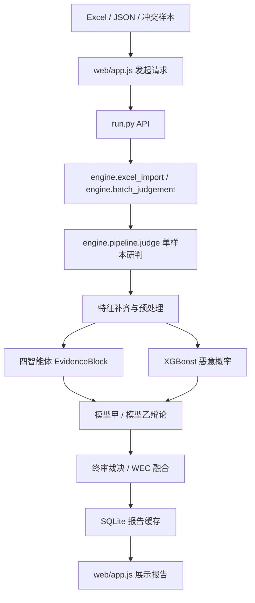

# MalApp 项目使用与调试说明

这份文档用于解决两个问题：打开 APP 后每个按钮背后调用哪段代码；出现导入失败、研判失败、模型超时、分数异常时应该从哪里开始 debug。

项目主目录：

```text
C:\Users\啤酒肚\Desktop\工作\test1
```

## 一、怎么启动

源码方式启动：

```powershell
cd C:\Users\啤酒肚\Desktop\工作\test1
.\.venv\Scripts\python.exe -u run.py
```

默认访问：

```text
http://127.0.0.1:8765
```

指定端口：

```powershell
$env:MALAPP_PORT="8788"
.\.venv\Scripts\python.exe -u run.py
```

桌面 EXE 通常放在：

```text
C:\Users\啤酒肚\Desktop\工作\test1\release
```

## 二、目录怎么看

```text
test1/
  run.py                         后端 HTTP API 入口，前端按钮最终都打到这里
  desktop_launcher.py            桌面 APP 启动器，负责拉起后端和窗口
  web/
    index.html                   页面骨架
    app.js                       前端逻辑：按钮、表格、请求 API、渲染报告
    styles.css                   页面样式
  engine/
    pipeline.py                  单样本研判主流水线，最重要
    batch_judgement.py           批量研判、暂停、继续、任务状态
    excel_import.py              Excel 预览和导入
    debate_flow.py               模型甲/模型乙辩论流程
    llm_local.py                 本地 Qwen 调用、JSON 提取和修复
    model_settings.py            本地/服务器模型配置
    xgb_runtime.py               XGBoost 推理和样本特征补齐
    hermes_runtime.py            Hermes 风格主管编排
    hermes_bridge.py             Hermes MCP 兼容桥接
    static_features.py           静态特征分析
    threat_intelligence.py       情报溯源分析
    impersonation.py             仿冒研判分析
    business_label.py            业务打标分析
  ml_pipeline/
    pipeline.py                  训练侧工具和模型训练逻辑
  training_artifacts/
    xgb*/                        训练出的 XGBoost 模型、阈值、测试集、曲线等
  converted_data/
    selected_app_import_*/       整理后的 APP 可导入 Excel 数据
  data/
    mvp.db                       默认运行数据库，保存导入数据、报告、缓存等
  tests/
    test_*.py                    自动化测试
```

## 三、完整研判流程和代码位置

### 1. 打开 APP

对应代码：

```text
desktop_launcher.py
run.py
web/index.html
web/app.js
web/styles.css
```

流程：

```text
桌面 EXE 或 python run.py
  -> 启动本地 HTTP 服务
  -> 浏览器/桌面窗口加载 web/index.html
  -> web/app.js 调用 /api/... 接口
```

### 2. 导入 Excel 数据

界面位置：

```text
数据加载 -> 接入 Excel 数据
```

后端接口：

```text
POST /api/data/excel-preview
POST /api/data/import-excel
```

对应代码：

```text
run.py
engine/excel_import.py::excel_preview()
engine/excel_import.py::import_excel()
```

你需要关注的输入项：

```text
工作表：选择 Excel 中哪个 sheet
表头所在行：字段名在哪一行
数据开始行：真正样本从第几行开始
本次传输数量：这次导入多少条
```

debug 方法：

```text
1. 先点“读取 Excel”，看预览表头是否正确。
2. 如果字段错位，调整“表头所在行”和“数据开始行”。
3. 如果导入后样本缺字段，检查 engine/excel_import.py 的字段映射逻辑。
```

### 3. 自动拉取冲突样本

界面位置：

```text
数据加载 -> 自动拉取冲突样本
```

后端接口：

```text
POST /api/preprocess/pull-conflicts
```

对应代码：

```text
run.py
engine/preprocess.py
```

作用：

```text
从 Engine A / Engine B 检测差异中挑出需要优先研判的样本。
例如：一个引擎判恶意，另一个引擎判良性，或者分数差异较大。
```

### 4. 批量研判

界面位置：

```text
新建研判 -> 自动研判流水线
```

后端接口：

```text
POST /api/batch-jobs/start
POST /api/batch-jobs/pause
POST /api/batch-jobs/resume
GET  /api/batch-jobs/status
```

对应代码：

```text
run.py
engine/batch_judgement.py::start_batch_judgement()
```

批量任务每处理一个样本，最终都会调用：

```text
engine/pipeline.py::judge()
```

### 5. 单样本研判主入口

最关键代码：

```text
engine/pipeline.py::judge(raw_sample)
```

它负责：

```text
输入一个样本
  -> 补齐数据库里的已有特征
  -> 静态、情报、仿冒、业务四类预处理
  -> 调用四个智能体输出 EvidenceBlock
  -> 调用 XGBoost 得到机器学习恶意概率
  -> 将四智能体证据送入模型甲/模型乙辩论
  -> 终审裁决
  -> 保存报告和缓存
```

### 6. 四个智能体

入口：

```text
engine/pipeline.py::run_agents()
```

四个智能体主要实现位置：

```text
engine/pipeline.py::static_analysis_agent()
engine/pipeline.py::threat_intel_agent()
engine/pipeline.py::impersonation_agent()
engine/pipeline.py::business_label_agent()
```

职责：

```text
静态分析智能体：验证签名一致性、识别加固/混淆、检查 SDK 风险、权限风险。
情报溯源智能体：挖掘 C2 域名、下载地址、邮箱、手机号、黑产家族、IOC 命中。
仿冒研判智能体：对比正版 APP 的 icon、包名、名称、签名，判断仿冒概率。
业务打标智能体：将技术特征翻译成反诈业务侧标签，例如涉诈分类、危害类型、家族、版本状态。
```

统一输出结构：

```json
{
  "claim": "该样本存在某类风险",
  "evidence": ["证据1", "证据2"],
  "confidence": 0.82
}
```

项目内部实际使用更完整的 `EvidenceBlock`：

```text
agent            智能体名称
claim            结论
evidence         简短证据文本
confidence       置信度，表示该智能体判断是否可靠
score            恶意概率或风险分数
evidence_items   结构化证据项
missing_fields   缺失字段
```

### 7. XGBoost 机器学习概率

推理入口：

```text
engine/xgb_runtime.py::predict()
```

训练侧入口：

```text
ml_pipeline/pipeline.py
```

XGBoost 在项目里的作用：

```text
用训练样本学习“哪些字段组合更像恶意/良性”。
它输出的是恶意概率，不负责生成自然语言证据链。
```

四个智能体可以使用 XGBoost 给出的领域概率作为 `score`，但证据解释仍来自字段、特征和模型辩论。

### 8. 双模型辩论

入口：

```text
engine/debate_flow.py::run_debate()
```

当前逻辑：

```text
四智能体 EvidenceBlock
  -> 模型甲初判
  -> 模型乙初判
  -> 交叉质疑
  -> 证据反驳
  -> 终审摘要
```

模型甲和模型乙可以并行工作。代码中使用 `ThreadPoolExecutor(max_workers=2)` 对初判、质疑、反驳、结案阶段做并行调用。

模型相关配置主要在：

```text
engine/model_settings.py
engine/debate_flow.py::build_provider()
```

常用环境变量：

```text
MALAPP_MODEL_A_API_URL          模型甲 OpenAI-compatible API 地址
MALAPP_MODEL_A_MODEL            模型甲模型名
MALAPP_MODEL_B_API_URL          模型乙 OpenAI-compatible API 地址
MALAPP_MODEL_B_MODEL            模型乙模型名
MALAPP_MODEL_API_TIMEOUT        模型调用超时时间，建议 180 或 300
MALAPP_MODEL_CONTEXT_TOKENS     模型上下文长度，例如 4096、8192、32768
MALAPP_MODEL_JSON_MODE          是否使用 JSON mode
MALAPP_DISABLE_LLM_RULE_FALLBACK 是否禁用规则回退
```

### 9. 最终裁决和报告保存

主要位置：

```text
engine/pipeline.py::wec_decision()
engine/decision_engine.py
engine/pipeline.py::judge()
```

默认数据库：

```text
C:\Users\啤酒肚\Desktop\工作\test1\data\mvp.db
```

报告查询接口：

```text
GET /api/reports
GET /api/dashboard/overview
```

## 四、出问题时怎么 debug

### 1. Excel 导入后字段不对

先查：

```text
web/app.js
run.py -> /api/data/excel-preview
engine/excel_import.py
```

排查顺序：

```text
1. 表头所在行是否正确
2. 数据开始行是否正确
3. Excel 是否只有一个 sheet，或者选择了正确 sheet
4. md5、sample_id、app_name、package_name 等核心字段是否存在
```

### 2. 批量研判失败

如果报：

```text
unsupported operand type(s) for +: 'dict' and 'dict'
```

说明某处把两个字典当数字或字符串相加，优先查：

```text
engine/pipeline.py
engine/debate_flow.py
engine/xgb_runtime.py
```

如果报：

```text
model call failed
timed out
HTTP Error 400
context length
output did not satisfy debate schema
```

优先查：

```text
engine/debate_flow.py
engine/llm_local.py
模型服务日志
```

### 3. 大模型输出不稳定

常见原因：

```text
1. 模型上下文太短，证据和提示词被截断
2. 输出 token 太少，JSON 没写完
3. 模型没有严格支持 JSON mode
4. 服务端超时
5. 提示词要求太复杂，模型输出自由文本
```

优先调整：

```text
MALAPP_MODEL_API_TIMEOUT=180
MALAPP_MODEL_CONTEXT_TOKENS=8192
MALAPP_MODEL_JSON_MODE=1
```

### 4. 页面显示“规则模式”

这代表模型没有完成有效推理，系统没有拿到可用的大模型辩论 JSON。

如果你明确要求“不使用规则回退”，失败样本就会显示失败，而不是生成伪辩论。

排查：

```text
1. 模型 API 是否可访问
2. API URL 是否是 /v1/chat/completions
3. 模型名是否正确
4. 上下文长度是否足够
5. 模型输出是否符合 debate schema
```

### 5. XGBoost 分数都一样

常见原因：

```text
1. 输入样本字段差异太少
2. 导入数据缺少关键特征
3. 训练数据不纯或标签单一
4. 当前命中的树路径相同
5. 阈值/校准参数让大量样本落在同一区间
```

排查：

```text
engine/xgb_runtime.py
training_artifacts/xgb*/feature_importance.csv
training_artifacts/xgb*/test_set_for_app.xlsx
```

### 6. 四智能体输出太乱

查：

```text
engine/pipeline.py
engine/agent_output.py
web/app.js
```

含义：

```text
engine/pipeline.py       负责生成 EvidenceBlock
engine/agent_output.py   负责校验和修复 EvidenceBlock
web/app.js               负责前端怎么展示
```

## 五、常用检查命令

Python 语法检查：

```powershell
cd C:\Users\啤酒肚\Desktop\工作\test1
.\.venv\Scripts\python.exe -m py_compile .\run.py .\desktop_launcher.py .\engine\pipeline.py .\engine\debate_flow.py .\engine\llm_local.py
```

运行测试：

```powershell
cd C:\Users\啤酒肚\Desktop\工作\test1
.\.venv\Scripts\python.exe -m pytest .\tests\test_pipeline.py .\tests\test_batch_judgement.py .\tests\test_hermes_bridge.py -q
```

检查前端 JS：

```powershell
cd C:\Users\啤酒肚\Desktop\工作\test1
node --check .\web\app.js
```

## 六、想改功能时看哪里

```text
想改页面文字、按钮、表格：
  web/app.js
  web/styles.css

想改 Excel 导入字段：
  engine/excel_import.py

想改四智能体证据输出：
  engine/pipeline.py
  engine/agent_output.py

想改模型甲/乙辩论格式：
  engine/debate_flow.py

想改模型服务配置：
  engine/model_settings.py
  run.py

想改 XGBoost 推理：
  engine/xgb_runtime.py

想重新训练 XGBoost：
  ml_pipeline/pipeline.py
  training_artifacts/

想改批量研判、暂停、继续：
  engine/batch_judgement.py

想改 Hermes 风格主管编排：
  engine/hermes_runtime.py
  engine/hermes_bridge.py

想重新打包 EXE：
  build/*.spec
  pyinstaller
```

## 七、核心流程图



## 八、最小 debug 路线

```text
1. 先确认导入数据是否正确：
   数据加载页 -> 读取 Excel -> 看预览字段

2. 再确认样本是否进入队列：
   新建研判页 -> 刷新批次 -> 看待研判数量

3. 再跑 1 条样本：
   本次自动研判数量填 1

4. 如果失败，看失败文字：
   Excel/字段问题 -> engine/excel_import.py 或 engine/pipeline.py
   模型问题 -> engine/debate_flow.py 或模型服务
   XGBoost 问题 -> engine/xgb_runtime.py

5. 如果成功但结果奇怪：
   先看报告里的四智能体证据
   再看模型甲/乙辩论
   最后看 XGBoost 概率和终审裁决
```
